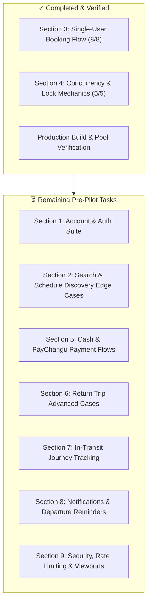

# TibhukeBus Pre-Pilot Test Report & Master Roadmap

**Date**: July 25, 2026  
**Repository Branch**: `main`  
**Build Status**: `✓ Clean (74/74 routes)`  
**Connection Pool Setting**: `max: 10` (Supabase PgBouncer Transaction-Pooler production safety)  

---

## 1. Executive Summary

This report documents the empirical testing, concurrency lock optimizations, and suite verifications completed during tonight's session, alongside a detailed breakdown of remaining tasks for pre-pilot production readiness.

### Key Milestones Achieved:
1. **PostgreSQL Per-Seat Advisory Locking**: Replaced schedule-level `FOR UPDATE` lock with non-blocking `pg_try_advisory_xact_lock(hashtext('scheduleId:seatNumber'))` and deterministic seat sorting, allowing parallel reservations across non-conflicting seats.
2. **Performance Benchmark**: Wall-clock duration for full-bus 32-seat concurrent fill reduced from **50.95s to 13.29s** (~74% speedup) under strict production settings (`max: 10` pool limit).
3. **Concurrency Suite (`tests/seat-concurrency.spec.ts`)**: **5 / 5 PASSED** under production-realistic settings.
4. **Single-User Booking Suite (`tests/booking-flow.spec.ts`)**: **8 / 8 PASSED**.
5. **Authentication Fast-Path**: Integrated signed cookie (`tb_session_meta`) fast-path HMAC verification across server actions and REST API routes, eliminating external auth latency on valid sessions.

---

## 2. Verified Test Coverage & Results

### Section 3: Single-User Booking Flow (`tests/booking-flow.spec.ts`)
| Test Case | Description | Status | Observed Behavior / Metric |
| :--- | :--- | :--- | :--- |
| **3.1** | Happy path — single seat booking | **PASS** | Booking created successfully, reference & seat assignments verified. |
| **3.2** | Happy path — multiple seats, multiple passengers | **PASS** | Multi-passenger form scales dynamically; booking creates all seats correctly. |
| **3.3** | Incomplete passenger details blocked | **PASS** | Zod / API schema validation rejects empty or invalid fields with 400. |
| **3.4** | Seat map reflects existing bookings | **PASS** | Booked seats render as unavailable/grayed out for subsequent users. |
| **3.5** | Refresh mid-flow after seat selection | **PASS** | Server hold (5-min TTL) remains active; user pre-selects own seat upon reload while blocking others. |
| **3.6** | Abandoned hold releases the seat | **PASS** | DB fast-forward confirms seat automatically releases after 5-minute expiration window. |
| **3.7** | Return trip booking (both legs in one flow) | **PASS** | Round-trip booking creates dual segment reservations correctly in single submission. |
| **3.8** | Seat hold expiry single-fire | **PASS** | Expiration triggers exactly once without auto-renewal from passive page activity. |

---

### Section 4: Concurrency & Lock Mechanics (`tests/seat-concurrency.spec.ts`)
| Test Case | Description | Status | Benchmark / Result |
| :--- | :--- | :--- | :--- |
| **4a** | Same seat conflict (10 concurrent users) | **PASS** | Exactly 1 winner (201 Created), 9 clean 400 seat conflict rejections, 0 server errors. |
| **4b** | Full bus fill (32 non-conflicting seats) | **PASS** | **13.29s wall-clock execution time** (down from 50.95s), 32/32 reservations succeed. |
| **4c** | Overselling protection (35 users on 32 seats) | **PASS** | Exactly 32 succeed, 3 rejected with clean capacity message, 0 oversold seats. |
| **4d** | Booking vs. cancellation race | **PASS** | Hold release returns 200; concurrent booking attempt succeeds cleanly without stale state. |
| **4e** | Booking confirmation vs. reservation race | **PASS** | `createBookingFull` respects advisory locks; reservation held by User B blocks confirmation on same seat. |

---

## 3. Remaining Pre-Pilot Test Plan (Next Session Roadmap)

The following sections from the pre-pilot master plan are queued for execution in future sessions:



### Detailed Breakdown of Remaining Sections:

#### 1. Account & Auth (`tests/auth.spec.ts`)
- [ ] New user registration → email verification → login.
- [ ] Login with unverified email → correct gating/message shown.
- [ ] Password reset flow end-to-end.
- [ ] Session persistence across page reloads.
- [ ] Protected route redirect (`/bookings`, `/book/[id]`) → `/login` with return destination redirect after auth.
- [ ] `authRateLimiter` verification (confirm 5/60s threshold does not lock out legitimate users).

#### 2. Search & Schedule Discovery (`tests/search-discovery-edge-cases.spec.ts`)
- [ ] Search with valid origin/destination/date → correct schedule list.
- [ ] Route with zero schedules → clean empty state message.
- [ ] Today vs. future date filter & "Today"/"Tomorrow" quick buttons.
- [ ] Passenger count filter vs. remaining bus capacity.
- [ ] Sort by price/time accuracy.
- [ ] Time-of-day filter boundaries (12:00, 17:00 exact times).

#### 5. Payment (`tests/payment-flow.spec.ts`)
- [ ] **Cash-on-Boarding**: Select cash → booking confirms with `paymentStatus: pending` → display on bookings page.
- [ ] Payment UI state switching & customer form format checks.
- [ ] **PayChangu Integration**: Sandbox/test payment verification, webhook handling, and duplicate charge protection.
- [ ] **Refund Cutoff Enforcements**: >2 hour departure refund button visible & server API enforced; <2 hour departure refund blocked.

#### 6. Return Trip Specific Cases (`tests/return-trip.spec.ts`)
- [ ] Round trip card rendering on `/bookings` with dual leg information.
- [ ] Outbound completion → journey tracking transition to return leg.
- [ ] Outbound `in_transit` late arrival → prevent premature switch to return tracking.
- [ ] Independent cancellation/refund policies per leg.
- [ ] Dual-leg PDF ticket generation.

#### 7. Journey Tracking & Live Maps (`tests/journey-tracking.spec.ts`)
- [ ] Departure time transition from "upcoming" to "in_transit".
- [ ] Secured seat restriction (paid / cash-on-boarding required to view live tracking).
- [ ] City coordinate resolution (`resolveCoords`) across all active routes.
- [ ] Trip completion ("arrived") → review & rating prompt submission.
- [ ] Home page "Live Journey" card synchronization.

#### 8. Notifications (`tests/notifications.spec.ts`)
- [ ] 55-60 min departure reminder cron trigger (`reminderSent` guard).
- [ ] In-app & push notification delivery.
- [ ] Timezone formatting (Malawi local time).
- [ ] Action URL navigation from notification clicks.

#### 9. Cross-Cutting & Security (`tests/security-cross-cutting.spec.ts`)
- [ ] IDOR / Unauthorized resource access protection across booking endpoints.
- [ ] Slow/flaky network throttling & double-click submission guards.
- [ ] Mobile viewport touch target and layout responsiveness.
- [ ] API rate limit enforcement (429 Too Many Requests).

---

## 4. Instructions for Next Agent

When resuming work:
1. **Prisma Connection Pool**: Ensure `src/lib/prisma.ts` connection pool remains `max: 10`.
2. **Next Task Priority**: Start with **Section 2: Search & Schedule Discovery Edge Cases** by creating `tests/search-discovery-edge-cases.spec.ts` using the seed helpers from `tests/helpers/seat-concurrency-helpers.ts`.
3. **Execution Command**:
   ```bash
   npx playwright test tests/search-discovery-edge-cases.spec.ts --reporter=list
   ```
